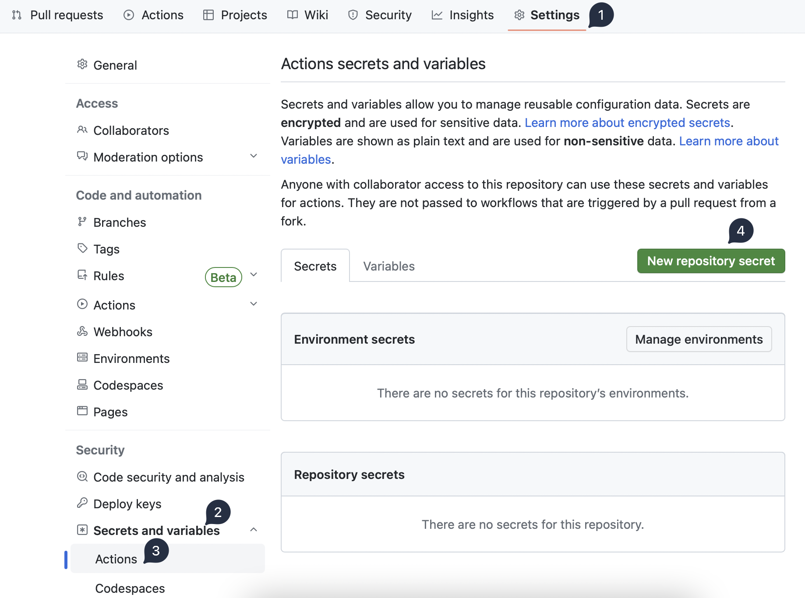
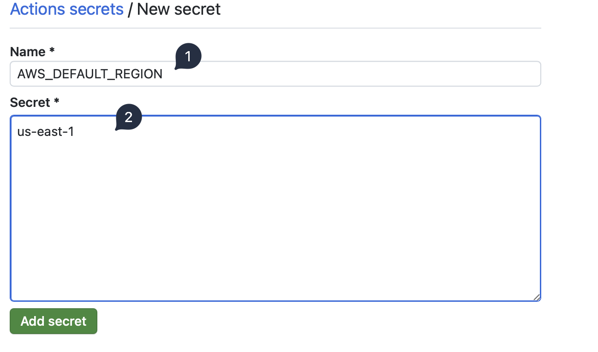
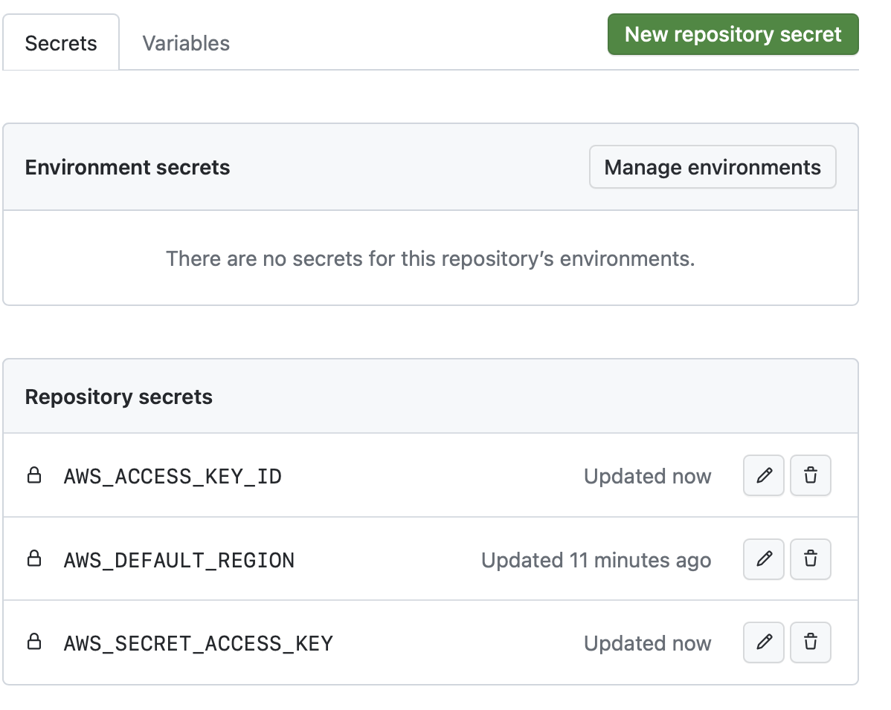
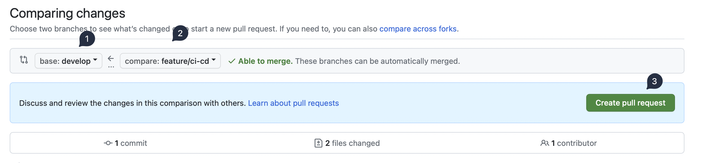
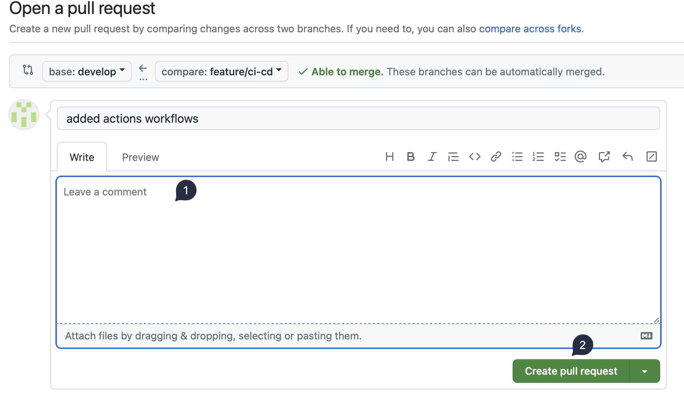
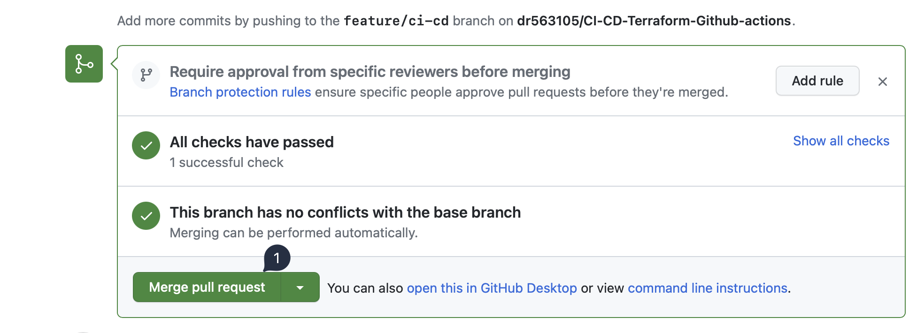
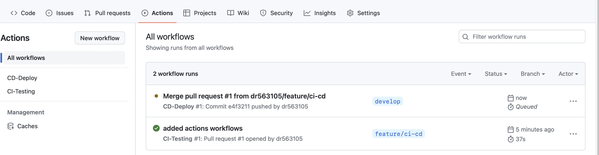
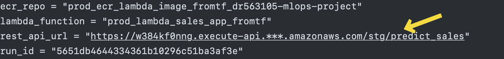

# CI-CD pipeline with Github Actions

## Requirements
1. Active AWS account
2. Knowledge of Docker, lambda_function, Terraform.

## Instructions
First create a fork of the repository. This way you can test out new features without putting main project at risk. Use the guide provided [here](https://docs.github.com/en/get-started/quickstart/fork-a-repo?tool=webui#forking-a-repository).

Now you have forked my repo into your profile, we now need to clone it into local system. Replace `YOUR-USERNAME` with your github username.

```bash
cd ~/ && git clone https://github.com/YOUR-USERNAME/CI-CD-Terraform-Github-actions.git && cd CI-CD-Terraform-Github-actions
```

Create two branches - `develop` and `feature/ci-cd`

```bash
git checkout -b develop # from main branch
git checkout main
git checkout -b feature/ci-cd # from main branch
```

In `ci-test.yaml` and `cd-deploy.yml`, we have explicitly given the `$AWS_DEFAULT_REGION` as `us-east-1`. Let us change that as a Github secret.

### Github setting->secrets
Goto "settings` tab of the repo, under security menu goto `Secrets and variables`. Under that select `Actions`. Click on `New repository secret`.



In the `Name` field, enter `AWS_DEFAULT_REGION` and in `Secret` the region of your choice.



Similarly add in `AWS_ACCESS_KEY_ID` and `AWS_SECRET_ACCESS_KEY`. 



### ci-test.yml and cd-deploy.yml

Now let us change [ci-test.yml](.github/workflows/ci-test.yml#L11) line number 11 from explicit `us-east-1` to `${{  secrets.AWS_DEFAULT_REGION  }}`.

Similarly change [cd-deploy.yml](.github/workflows/cd-deploy.yml#L11).

## Commit the changes and push it to the remote feature branch

Remember we are in the `feature/ci-cd` branch. 

```bash
cd ~/CI-CD-Terraform-Github-actions
git add .
git commit -m "added github secrets"
git remote set-url origin https://github.com/YOUR-USERNAME/CI-CD-Terraform-Github-actions.git
git push origin feature/ci-cd
```
Give your credentials when prompted. Even better approach is to use the ssh remote link. That way we don't need to enter credentials at every push. 

Publish `develop` branch to the remote.
```bash
git checkout develop
git push origin develop # to make remote aware of local develop branch
```
## Pull request

Goto the `Pull requests` tab in the repo, click on `New request`.

Change `base:` to `develop` and `compare:` to `feature/ci-cd`. Click `Create pull request`. 



Write some comment and create a pull request. Refresh the page after a few seconds to see the actions being triggered.



## Merge pull request to develop

After a minute, the action should finish. Upon refresh we should see the `merge request` button being green and all checks have passed. Click on `merge pull request` and `confirm merge`.



We goto the `actions` tab. We will see our merge has triggered the deployment actions. This process will take at least 3-5 minutes to finish depending on the Github's hosting service.



Click on the `merge pull request` action. Then click on the job `build-push-deploy`. You see all the tasks that have been completed. Click on `TF-apply` and scroll down to the very bottom. There we can get our `api_url`. 

.

`rest_api_url = "https://w384kf0nng.execute-api.***.amazonaws.com/stg/predict_sales"`

Replace `***` with aws region where the api is hosted. In my case it is `us-east-1`. This `***` behaviour is because we defined our AWS region as a secret. 

Use the full url in any of the REST_API request client such as postman, thunder client along with this sample input inside the body.

```json
{"find": {"date1": "2017-08-23", "store_nbr": 9}}
```

Hit "Send". On the first attempt there might be endpoint timeout. But, don't worry that input entry will be present in the DynamoDB table.

```json
{
  "statusCode": 200,
  "body": "{'store_id': 9, 'item_id': 1909409, 'family': 'CLEANING', 'prediction_date': '2017-08-23', 'inserted_at': '2023-06-13T10:34:24', 'unit_sales': '3.94'} - successfully created item!"
}
```

## Deleting resources

If for some reason you wish to delete the resources created in the AWS Cloud, please follow these steps.

1. Create a new feature branch or use a branch other than main or develop.

2. Goto [infrastructure's main.tf](infrastructure/main.tf) file. Comment out all the modules. Also comment out contents in [outputs.tf](infrastructure/outputs.tf) 

3. Commit, push and create a pull request. That should run the CI tests and tell us the number of resources to be destroyed

4. Then merge that request to the develop branch. `TF-apply` job will get triggered and as all the modules are now commented out, the action will delete all the resources created. Always verify in the AWS console if the deletion is successful.

## Merging develop to main branch

We need to commit our changes from the develop branch to the main. Don't worry new resources won't be created as result of the merge.

```bash
git checkout develop # if in someother branch
git pull origin develop --rebase # pull latest changes from remote
git checkout main
git merge origin develop # to merge develop branch to main
git push origin main # to publish main branch changes to remote
```
